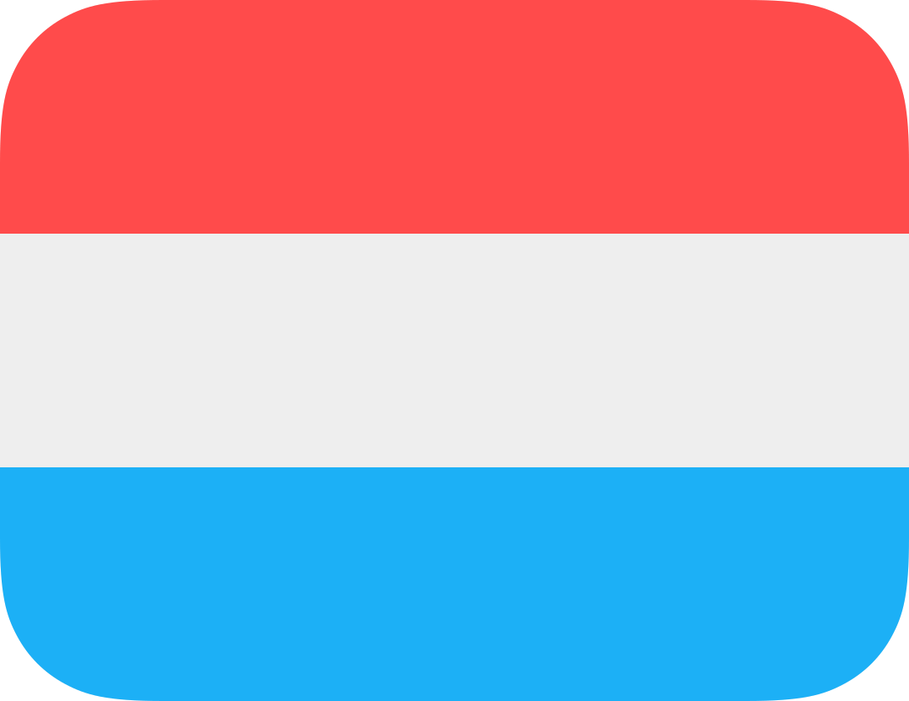
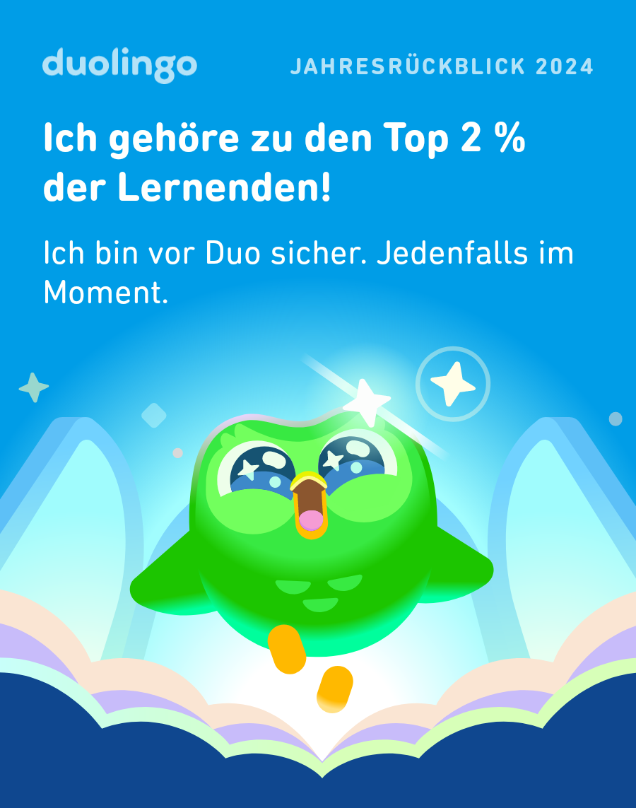
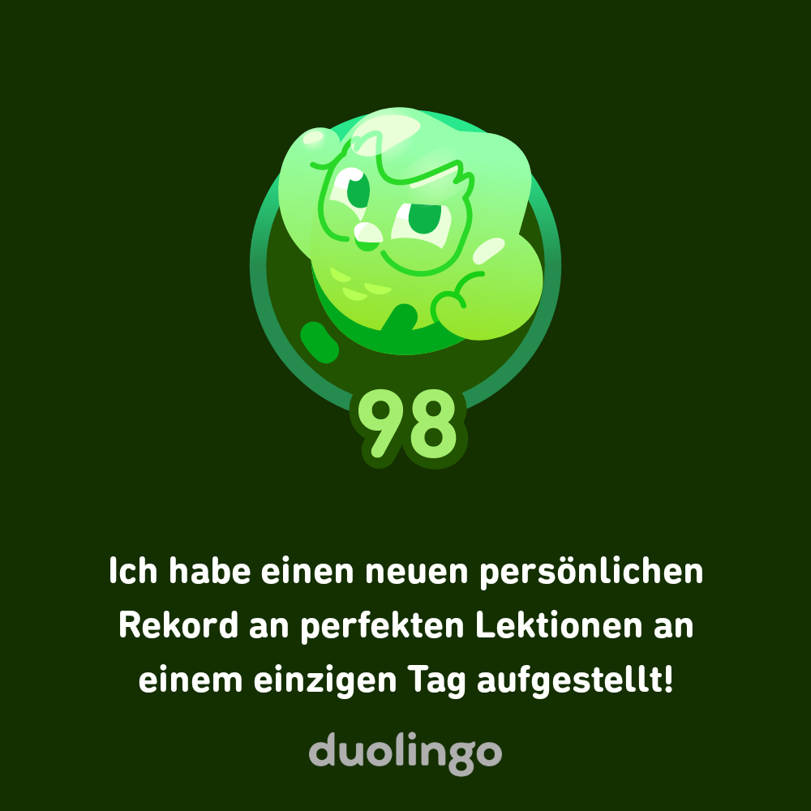
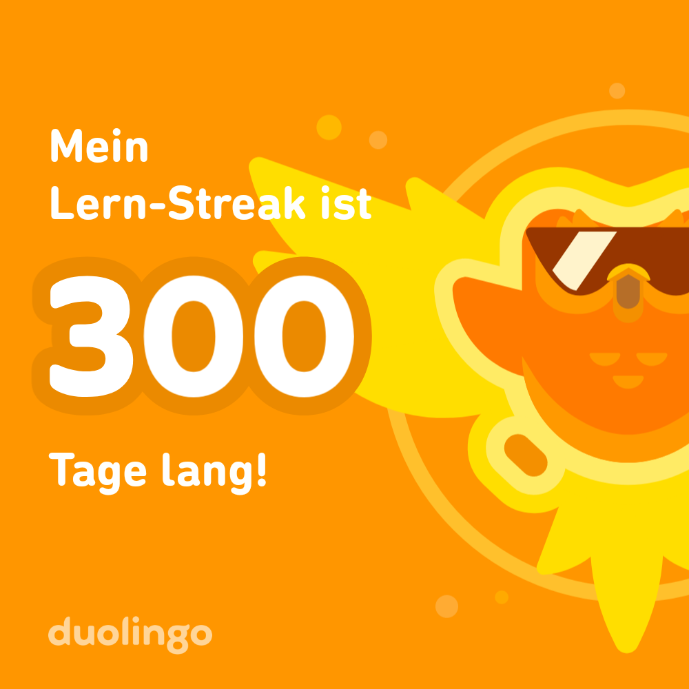
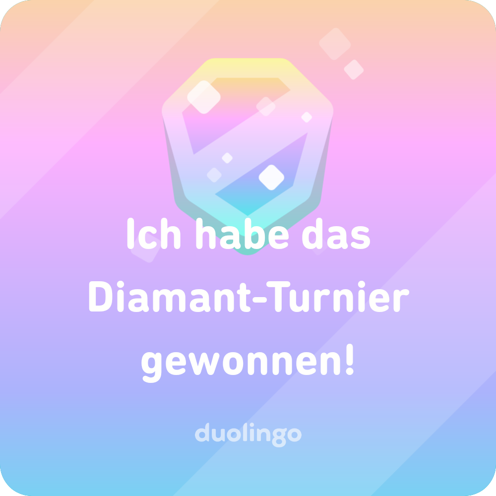
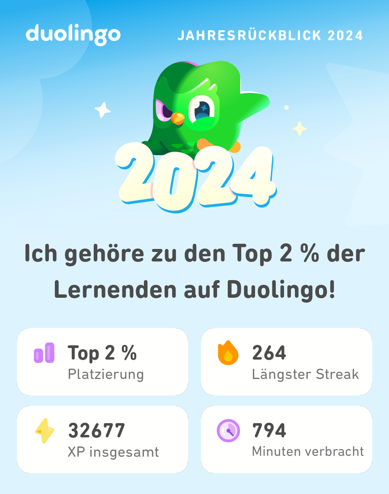
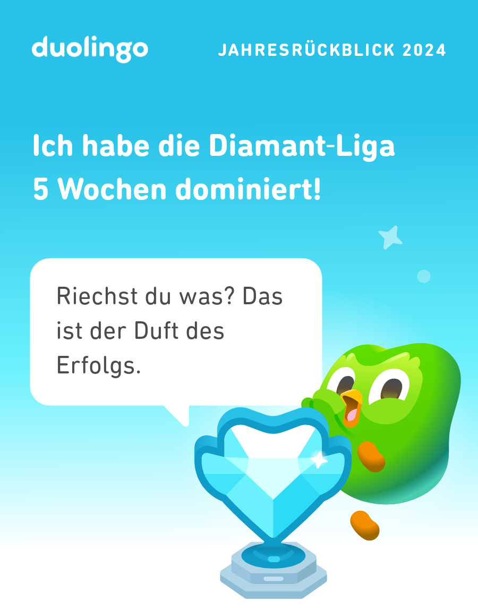

 

<h1 align="left">Hi 👋!  It´s me Noah,</h1>

#####
)
)

#####

<h2 align="left">🙋‍♂️ About me</h2>

###

I´m from Germany, specifically the Münsterland region. ⛺️ I am currently pursuing my advanced technical college certificate as an IT assistant. 🏫  I design websites and online shops for businesses and individuals, manage social media strategies, and have a proven track record in professional food retail management, focusing on customer relations and sales optimization. 💼 Additionally, I serve as a firefighter. 🚒 In my free time, I enjoy playing Poly Bridge (3), skiing, and connecting with others.

#####

###

<h2 align="left">🔨 worked/ working with</h2>

###

  
  
  
  
  
  
  
  
  
  
  
  
  
  
  
  
  
  
  
  
  
  
  
  
  
  
  
  
  
  
  
  
  
  
  
  
  

#####

<h2 align="left">🗺️ Languages I´m learning </h2>

<h3 align="left">Achievements I made while learning these languages on </h3>

 
   
    
    

 
   
    
    

#####

<h2 align="center">📈 GitHub statistics</h2>

###

  
  

#####

